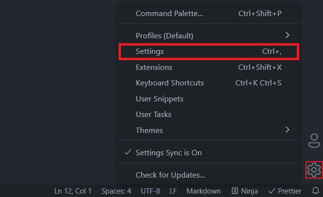
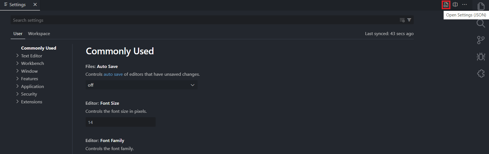
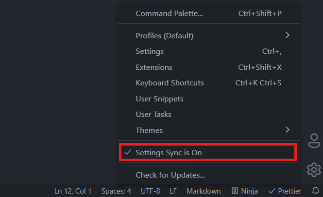

# Visual Studio Code

## Visual Studio Code Configuration and Extensions

Open Visual Studio Code settings.



You can edit the VS Code settings through the visual interface or editing the settings.json file.



These settings override the default VS Code configuration. You can find the "settings.json" file in the following locations.

```
Windows %APPDATA%\...\Code\User\settings.json
macOS $HOME/Library/ApplicationSupport/Code/User/settings.json
Linux $HOME/.config/Code/User/settings.json
```

## Visual Studio Code Extensions.

To export Visual Studio Code Extensions, execute the following command.

```console
$ code --list-extensions
```

To install an extension from the command line you can execute the following command.

```console
$ code --install-extension <extension>
```

## Visual Studio Code Settings Sync

Enable Visual Studio "Settings Sync" to automatically sync these settings.



## My Visual Studio Code

You can found my VSCode settings and extensions in the "extensions" and "settings" folders.

```bash
    ├── extensions
    │   └── extensions.txt
    ├── images
    │   ├── vscode-settings-json.png
    │   ├── vscode-settings-sync.png
    │   └── vscode-settings.png
    ├── settings
    │   └── settings.json
    ├── .git
    └── README.md
```
